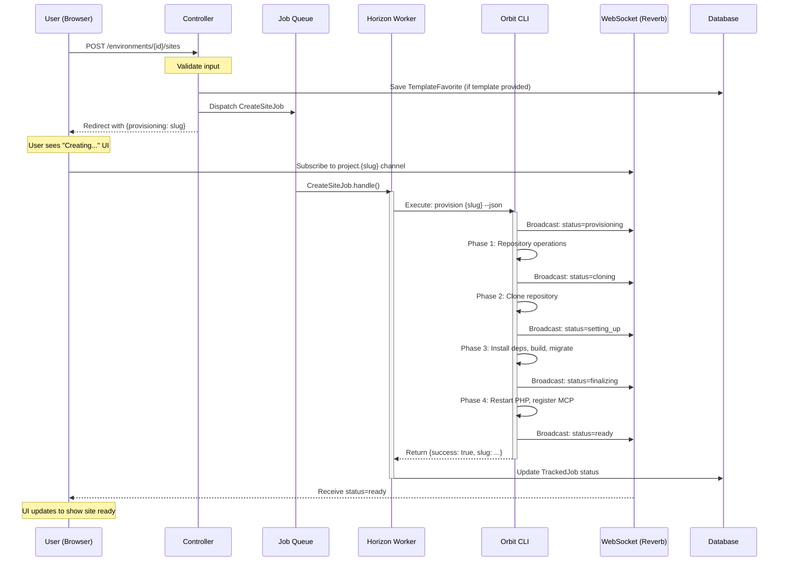
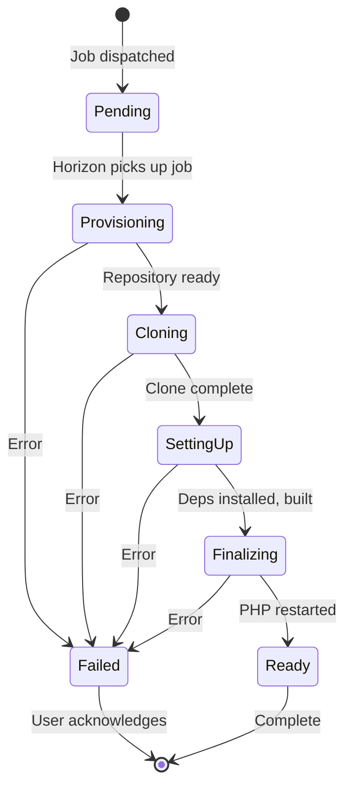

# Site Creation Flow

> **Single Source of Truth** for the site creation workflow.  
> Reference this document during any refactoring to ensure consistency.

## Core Principle

**The flow is IDENTICAL for local and remote environments.**

There is no branching based on environment type. Every site creation:
1. Goes through the job queue
2. Is processed asynchronously
3. Uses the CLI for provisioning

## Sequence Diagram



## State Machine



## Component Responsibilities

| Component | Responsibility |
|-----------|----------------|
| **Controller** | Validate input, dispatch job, return immediately |
| **CreateSiteJob** | Call CLI, handle errors, update TrackedJob |
| **Orbit CLI** | Execute provisioning, broadcast progress |
| **WebSocket** | Real-time status updates to browser |
| **TrackedJob** | Persist job status for recovery/polling |

## API Contract

### Request
```
POST /environments/{id}/sites
Content-Type: application/json

{
  "name": "my-project",
  "template": "laravel/laravel",
  "is_template": true,
  "visibility": "private",
  "php_version": "8.4",
  "db_driver": "pgsql",
  "session_driver": "redis",
  "cache_driver": "redis",
  "queue_driver": "redis"
}
```

### Response (Web Request)
```
302 Redirect to /environments/{id}/sites
Session: {provisioning: "my-project", success: "Site is being created..."}
```

### Response (API Request)
```json
HTTP 202 Accepted

{
  "success": true,
  "message": "Site creation queued",
  "slug": "my-project",
  "job_id": "01234567-89ab-cdef-0123-456789abcdef"
}
```

## Error Handling

| Error Type | Handler | User Experience |
|------------|---------|-----------------|
| Validation error | Controller | Immediate redirect back with errors |
| Job dispatch failure | Controller | Error flash message |
| CLI failure | CreateSiteJob | WebSocket broadcasts error, TrackedJob marked failed |
| Timeout | Horizon | Job marked failed, user sees error via WebSocket |

## What NOT to Do

1. **Never call CLI synchronously** from the controller
2. **Never branch** on `$environment->is_local` for the dispatch flow
3. **Never skip** the job queue for "faster" local execution
4. **Never return** from controller before dispatching the job

## Related Files

- `src/Http/Controllers/EnvironmentController.php:879` - `storeSite()` method
- `src/Jobs/CreateSiteJob.php` - Async job class
- `src/Models/TrackedJob.php` - Job status tracking
- `orbit-cli/app/Commands/ProvisionCommand.php` - CLI provisioning
- `resources/js/composables/useSiteProvisioning.ts` - WebSocket listener

## Changelog

| Date | Change |
|------|--------|
| 2026-01-19 | Initial documentation |
| 2026-01-19 | Implemented CreateSiteJob, updated controller to dispatch async |
