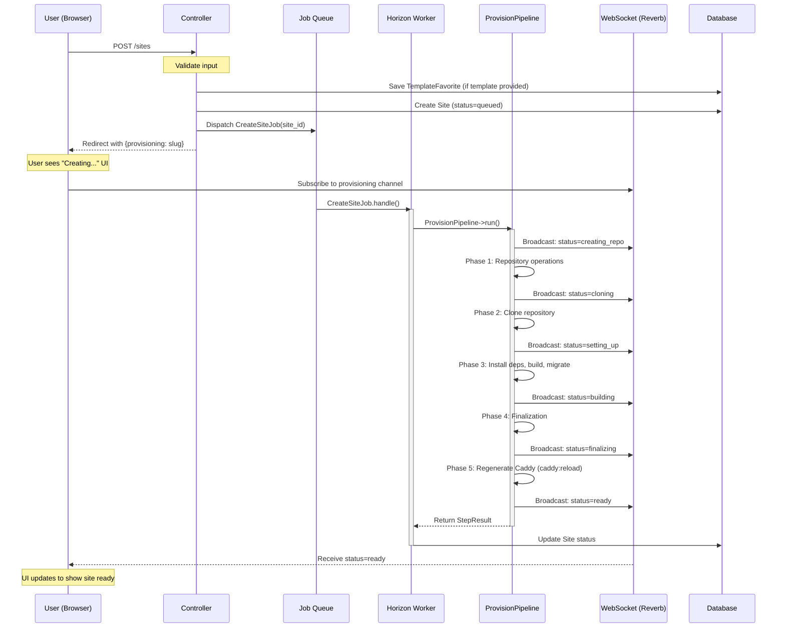
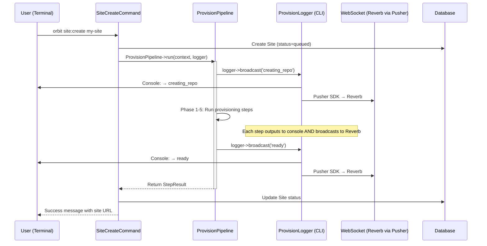
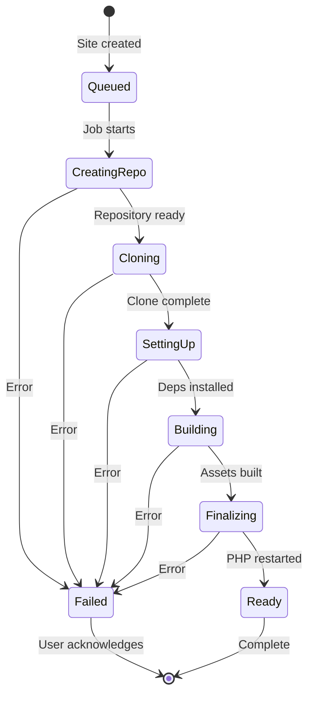

# Site Creation Flow

> **Single Source of Truth** for the site creation workflow.  
> Reference this document during any refactoring to ensure consistency.

## Prerequisites

**Horizon must be running** for site creation to work. Without it, jobs won't be processed and sites will be stuck in "Initializing" state forever.

```bash
# Start Horizon (development)
cd ~/projects/orbit-web && php artisan horizon

# Verify it's running
php artisan horizon:status
```

## Core Principle

**`ProvisionPipeline` is the single source of truth** for provisioning logic.

Both entry points use the same pipeline:
1. **Web UI** → Dispatches `CreateSiteJob` to Horizon → Async
2. **CLI** → Runs `ProvisionPipeline` synchronously → Real-time output

The pipeline accepts a `ProvisionLoggerContract` interface, allowing each consumer to provide its own logger:
- **orbit-core's `ProvisionLogger`**: Uses native Laravel `event()` broadcasting
- **orbit-cli's `ProvisionLogger`**: Outputs to console + broadcasts via Pusher SDK

## Sequence Diagram (Web UI Flow)



## Sequence Diagram (CLI Flow)



## State Machine



## Component Responsibilities

| Component | Responsibility |
|-----------|----------------|
| **Controller** | Validate input, create Site (queued), dispatch job, return immediately |
| **CreateSiteJob** | Run ProvisionPipeline, handle errors, update Site status |
| **ProvisionPipeline** | Orchestrate provisioning actions, broadcast progress via native events |
| **ProvisionLogger** | Dispatch native Laravel broadcasting events to Reverb |
| **WebSocket** | Real-time status updates to browser (Echo configured once per app) |
| **Site** | Persist status for recovery/polling |

**Note:** The CLI's `site:create` command runs `ProvisionPipeline` synchronously with real-time console output, while web UI uses `CreateSiteJob` via Horizon. Both paths share the same provisioning logic.

## Active Environment Rules

Orbit web/desktop rely on a single active environment in the database.

- `EnvironmentManager::current()` resolves the active environment for requests.
- `POST /environments/{environment}/switch` updates the active environment.
- `/` renders the active environment dashboard in web mode via `EnvironmentController@show`.
- `/sites` uses the active environment and does not require an ID in the URL.

## API Contract

### Request
```
POST /sites
Content-Type: application/json

{
  "name": "my-project",
  "template": "laravel/laravel",
  "is_template": true,
  "visibility": "private",
  "php_version": "8.4",
  "db_driver": "pgsql",
  "session_driver": "redis",
  "cache_driver": "redis",
  "queue_driver": "redis"
}
```

### Response (Web Request)
```
302 Redirect to /environments/{active_id}/sites
Session: {provisioning: "my-project", success: "Site is being created..."}
```

### Response (API Request)
```json
HTTP 200 OK

{
  "success": true,
  "message": "Site creation queued",
  "slug": "my-project",
  "site": {
    "id": 123,
    "slug": "my-project",
    "status": "queued"
  }
}
```

## Error Handling

| Error Type | Handler | User Experience |
|------------|---------|-----------------|
| Validation error | Controller | Immediate redirect back with errors |
| Job dispatch failure | Controller | Error flash message |
| CLI failure | CreateSiteJob | WebSocket broadcasts error, Site marked failed |
| Timeout | Horizon | Site marked failed, user sees error via WebSocket |

## WebSocket Setup (Vue)

Orbit's frontend uses Laravel's official `@laravel/echo-vue` composables with a
single global Echo connection. The Reverb configuration comes from the active
environment and is injected as an Inertia prop. Component-level subscriptions are
managed by the composables and automatically cleaned up when components unmount.

Key files:
- `resources/js/app.ts` configures Echo from the `reverb` page prop
- `resources/js/composables/useSiteProvisioning.ts` subscribes via `useEchoPublic`
- `resources/js/pages/environments/Services.vue` listens for service status updates

## What NOT to Do (Web/Desktop Consumers)

1. **Never call CLI synchronously from controllers** - always dispatch a job
2. **Never branch** on `$environment->is_local` for the dispatch flow
3. **Never skip** the job queue for "faster" local execution
4. **Never return** from controller before dispatching the job

## Why Jobs Run Synchronously

The async rule applies to **web/desktop consumers**, not to how jobs execute internally.

The pattern is:
- **Controller** → Dispatches job → Returns immediately (async from user's perspective)
- **Job** → Runs ProvisionPipeline synchronously → That's the whole point of using a job

Jobs exist specifically to move long-running operations off the request thread. The job worker blocks while provisioning runs - this is correct and expected. The "async" is about the HTTP response, not the job execution.

**Architecture note:** Provisioning now uses native Laravel broadcasting (`SiteProvisioningStatus` event with `ShouldBroadcastNow`) instead of CLI → Pusher SDK. This simplifies debugging (single process) and uses standard Laravel patterns.

## Related Files

### orbit-core
- `src/Http/Controllers/EnvironmentController.php:685` - `storeSite()` method
- `src/Http/Controllers/SiteController.php` - Web entry point (`POST /sites`)
- `src/Services/EnvironmentManager.php` - Active environment resolution
- `src/Jobs/CreateSiteJob.php` - Async job, runs ProvisionPipeline
- `src/Contracts/ProvisionLoggerContract.php` - Interface for logger implementations
- `src/Services/Provision/ProvisionPipeline.php` - Main provisioning orchestrator
- `src/Services/Provision/ProvisionLogger.php` - orbit-core's logger (native events)
- `src/Services/Provision/Actions/*` - Individual provisioning steps
- `src/Events/SiteProvisioningStatus.php` - Broadcasting event
- `src/Data/ProvisionContext.php` - Context DTO for actions
- `src/Data/StepResult.php` - Action result wrapper
- `src/Models/Site.php` - Site status tracking
- `resources/js/composables/useSiteProvisioning.ts` - WebSocket listener

### orbit-cli
- `app/Commands/SiteCreateCommand.php` - CLI entry point, runs ProvisionPipeline sync
- `app/Services/ProvisionLogger.php` - CLI's logger (console + Pusher SDK)
- `app/Services/ReverbBroadcaster.php` - Broadcasts to Reverb via Pusher SDK

## Job Options Reference

The `CreateSiteJob` receives these options and passes them to `ProvisionPipeline`:

| Option | Purpose | Notes |
|--------|---------|-------|
| `name` | Site name | Slug derived from this |
| `org` | GitHub organization | For template/fork operations |
| `template` | Template repo | GitHub repo URL |
| `is_template` | Template vs clone | Determines RepoIntent |
| `fork` | Fork mode | Fork vs import |
| `visibility` | Repo visibility | `private` or `public` |
| `directory` | Site path | Override default site path |
| `php_version` | PHP version | e.g., `8.4` |
| `db_driver` | Database driver | `sqlite` or `pgsql` |
| `session_driver` | Session driver | |
| `cache_driver` | Cache driver | |
| `queue_driver` | Queue driver | |

Tests in `tests/Unit/Jobs/CreateSiteJobTest.php` verify job behavior.

## Browser Tests

E2E browser tests are available in `orbit-web/tests/e2e/site-creation.spec.ts`.

```bash
# Run all site creation tests
cd ~/projects/orbit-web
npx playwright test tests/e2e/site-creation.spec.ts

# Run specific test group
npx playwright test tests/e2e/site-creation.spec.ts --grep "Site Creation Form"
```

Test coverage:
- Form loading and elements
- Organization dropdown (GitHub integration)
- Form validation and submit button state
- Template detection and metadata
- Site creation submission and status tracking
- Full provisioning completion (90s timeout)

## Changelog

| Date | Change |
|------|--------|
| 2026-01-19 | Initial documentation |
| 2026-01-19 | Implemented CreateSiteJob, updated controller to dispatch async |
| 2026-01-19 | Fixed `--org` -> `--organization` flag, added CLI flag reference |
| 2026-01-19 | Consolidated `provision` into `site:create` - single command for all site creation |
| 2026-01-19 | Added Playwright e2e browser tests for site creation flow |
| 2026-01-20 | Switched to @laravel/echo-vue composables with global Echo config |
| 2026-01-22 | Moved provisioning from CLI to orbit-core ProvisionPipeline with native Laravel broadcasting |
| 2026-01-22 | Added automatic Caddy regeneration via `orbit caddy:reload` after site provisioning |
| 2026-01-22 | CLI `site:create` runs ProvisionPipeline synchronously with real-time output |
| 2026-01-22 | Added `ProvisionLoggerContract` interface for CLI/web logger implementations |
| 2026-01-22 | CLI broadcasts to Reverb via Pusher SDK for web UI updates during sync execution |
| 2026-01-22 | Active environment manager + switch route for web/desktop site creation |
